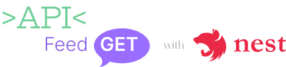

<h1 align="center">
  
</h1>

# :page_with_curl: Índice

* [Sobre o projeto](#interrobang-sobre-o-projeto)
  - [Tecnologias utilizadas](#-tecnologias-utilizadas)
* [Executando a aplicação](#rocket-executando-a-aplicação)
* [Para contribuir](#mailbox-para-contribuir)
* [Histórico de atualizações](#clock10-histórico-de-atualizações)

# :interrobang: Sobre o projeto

Projeto realizado durante a NLW#Return realizado pela Rocketseat. Foi desenvolvido um widget para o usuário realizar feedback de maneira interativa. Para acessar a versão com express clique [aqui](https://github.com/PedroHenry-Santos/Api-feedget).
## 🧑‍💻 Tecnologias utilizadas

- [NestJS](https://nestjs.com/)
- [TypeScript](https://www.typescriptlang.org/)
- [Prisma](https://www.prisma.io/)
# :rocket: Executando a aplicação

Primeiramente clone o repositório para sua maquina ou faça o 'download' em formato ZIP e descompacte. Para realizar a clonagem do repositório utilize o comando:

    git clone git@github.com:PedroHenry-Santos/Api-feedget-nestjs.git

Após basta instalar as dependência utilizando o gerenciador de pacote de sua preferência. Conforme abaixo:

    yarn install

E utilizar o comando:

    yarn start:dev

Agora você pode acessar [`localhost:3333/api`](http://localhost:3333/api) do seu client de API. Ex.: [Insomnia](https://insomnia.rest/). Com o projeto em execução, acesse [`localhost:3333/api/docs/v1`](http://localhost:3333/api/docs/v1) para visualizar a documentação.
# :mailbox: Para contribuir

Caso queira ajudar a implementar novas funcionalidade nessa aplicação, basta propor a sua funcionalidade em [CONTRIBUTING](https://github.com/PedroHenry-Santos/Api-feedget-nestjs/blob/main/CONTRIBUTING.md).
## :clock10: Histórico de atualizações

Para saber sobre as [versões](https://github.com/PedroHenry-Santos/Api-feedget-nestjs/releases) deste código consulte o CHANGELOG detalhado.

# :lock: Licença

[MIT License](https://github.com/PedroHenry-Santos/Api-feedget-nestjs/blob/main/LICENCE.md) ® [Pedro Santos](https://github.com/PedroHenry-Santos)
